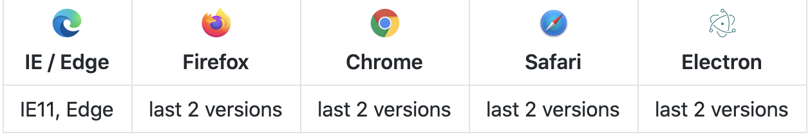

# CyanX
##### CyanX是一款基于ReactHook的，针对函数式组件的极简、可扩展的状态管理器
##### 设计哲学——任何状态，无论在哪都应该简单快速地获得


## 特性

* 极简，1分钟上手，两行代码
* 无限层级叠加，告别组件之间复杂的传值
* 极低的内存消耗，数据按需加载，组件所需的状态值变化时，才会重新渲染
* 基于ReactHook，仅支持React函数式组件开发      


## 兼容环境
#### 现代浏览器和 IE11




## 安装

* npm

`$ npm install cyanx`

* yarn

`$ yarn add cyanx`


## 核心概念
### Public Store（公用仓库）
##### 存放多个组件均需使用的状态的仓库

存放的数据类型

* __值类型(基本类型)__：字符串（String）、数字(Number)、布尔(Boolean)、对空（Null）、未定义（Undefined）、Symbol
* __引用数据类型__：对象(Object)、数组(Array)、函数(Function)
* __函数方法__

### withCyanxObserver（<u>观察者</u>）
##### 观察指定的公用仓库&使用此公用仓库中状态的<u>可观察组件</u>，当公用仓库的某个状态值发生变化时，会重新渲染使用了此状态的<u>可观察组件</u>

`withCyanxObserver(component, publicStoreName, publicStoreDefaultValues)`是一个高阶组件HOC，有3个参数


| 参数名 | 是否必填 | 说明 |
| ---- | ---- | ---- |
| component  | *必填 | 需转化为<u>观察者</u>的组件 |
| publicStoreName | *必填 | 需观察公用仓库的名称 |
| publicStoreDefaultValues | *必填 | 公用仓库的默认值 |


### withCyanxObservable（<u>可观察</u>的）
##### 将组件转为<u>可观察</u>状态，并得到所需的公用仓库的状态（存于props中），当使用的公用仓库的状态值改变时，将自动重新渲染，并得到最新的公用仓库的状态

`withCyanxObservable(component, publicStoreName, stateKeyArray)`是一个高阶组件HOC，有3个参数  

| 参数名 | 是否必填 | 说明 |
| ---- | ---- | ---- |
| component | *必填 | 需转化为<u>可观察</u>的组件 |
| publicStoreName | *必填 | 需引入的公用仓库的名称 |
| stateKeyArray | 选填 | 组件需引用的公用仓库中状态的Key名称，引入的state会直接存入<u>可观察组件</u>的props中 |

### dispatch（调遣）
##### dispatch是一个函数function，用于改变公用仓库的状态

特征

* 每一个公用仓库都会有唯一一个dispatch函数
* dispatch会存在<u>可观察组件</u>的props中,函数名为`${公用仓库的名称}Dispatch`；或<u>可观察组件</u>的props中的名为`${公用仓库的名称}`的对象。此中有`dispatch`的元素
  例子：有一个公用仓库`publicStore`，<u>可观察组件</u>`C`观察了公用仓库`publicStore`；<u>可观察组件</u>`C`获取公用仓库`publicStore`的`dispatch`可以通过一下两种方式拿到：
  `props.publicStoreDispatch`
  ||
  `props.publicStore.dispatch`

* dispatch改变状态的规则，同React中的setState()函数

  
## 实例
### 常量

```javascript
// 公用仓库的名称
const PublicStoreName = 'publicStore';// 公用仓库的名称，自己定义

// 公用仓库默认值
const publicStoreDefaultValues = {
    a: 1,
    b: {},
    c: ()=>{},
}
```

### 设置观察者组件&需观察的公用仓库

```javascript
import { withCyanxObserver } from 'cyanx';// 引入观察者HOC

// 观察者组件
const ComponentObserver = () => {
	...
	
	return (
	    <>
		    <ComponentObservable />
		</>
	)
}

export default withCyanxObserver(ComponentObserver, PublicStoreName, publicStoreDefaultValues);
```

### 转化<u>可观察组件</u>&组件所需的公用仓库的状态

```javascript
import { withCyanxObservable } from 'cyanx';// 引入可观察的HOC

// 观察者组件
const ComponentObservable = ({a, b, c, publicStoreDispatch, ...props}) => {...}

||

const ComponentObservable = (props) => {
    const {a, b, c, dispatch} = props.publicStore;
}


export default withCyanxObservable(ComponentObservable, PublicStoreName, ['a', 'b', 'c']);
```


## 注意事项
##### 出于内存的考虑，建议<u>观察者组件</u>的下1级的子组件均转化成<u>可观察组件</u>

## GitHub 
##### https://github.com/Bholder/CyanX

## License
##### MIT
Copyright (c) 2020-present, Bholder CY
